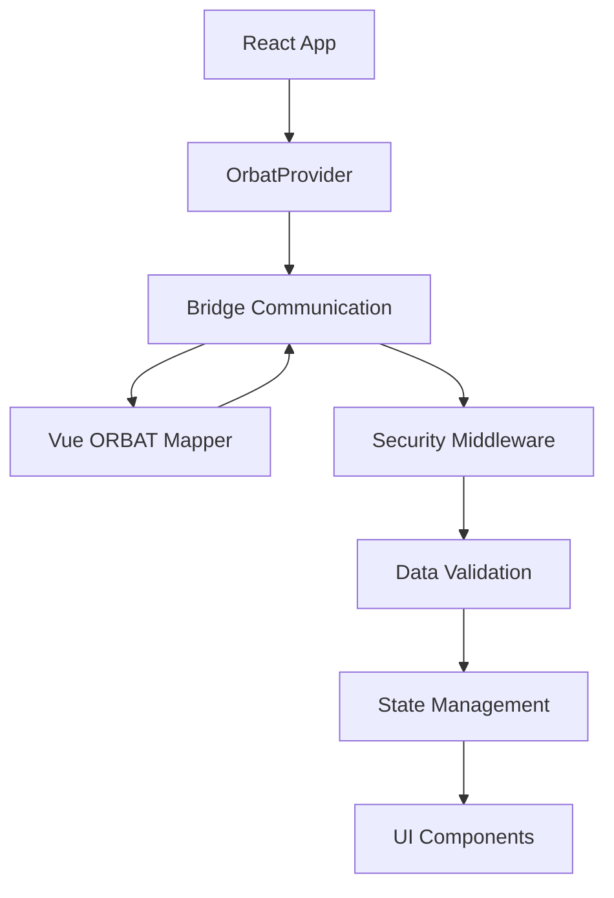

# ORBAT Integration Documentation

## Overview

Complete documentation for the ORBAT Integration module - a comprehensive React-based system for integrating Vue ORBAT Mapper into React applications with advanced security, templating, and monitoring capabilities.

## Documentation Index

### 📚 Core Documentation

1. **[API Documentation](./API_DOCUMENTATION.md)**
   - Complete API reference for all components, hooks, and utilities
   - Type definitions and interfaces
   - Usage examples and best practices

2. **[Setup & Installation Guide](./SETUP_GUIDE.md)**
   - Step-by-step installation instructions
   - Environment configuration
   - Development and production setup
   - Docker deployment guide

3. **[Configuration Guide](./CONFIGURATION.md)**
   - Comprehensive configuration options
   - Environment-specific settings
   - Security and performance configuration
   - Advanced configuration patterns

4. **[Developer Guide](./DEVELOPER_GUIDE.md)**
   - Getting started examples
   - Common usage patterns
   - Advanced implementation techniques
   - Testing strategies

5. **[Troubleshooting & FAQ](./TROUBLESHOOTING.md)**
   - Common issues and solutions
   - Performance optimization tips
   - Security troubleshooting
   - Frequently asked questions

## Quick Start

### Minimal Setup

```tsx
import React from 'react';
import { OrbatProvider, OrbatViewer } from './modules/orbat-integration';

function App() {
  return (
    <OrbatProvider config={{ vueAppUrl: 'http://localhost:5173' }}>
      <OrbatViewer mode="map" height="400px" />
    </OrbatProvider>
  );
}
```

### Full Featured Setup

```tsx
import React from 'react';
import { 
  OrbatProvider, 
  SecuritySuiteProvider,
  ResponsiveProvider,
  OrbatThemeProvider 
} from './modules/orbat-integration';

function App() {
  return (
    <SecuritySuiteProvider>
      <OrbatThemeProvider>
        <ResponsiveProvider>
          <OrbatProvider config={{ vueAppUrl: 'http://localhost:5173' }}>
            <YourApplication />
          </OrbatProvider>
        </ResponsiveProvider>
      </OrbatThemeProvider>
    </SecuritySuiteProvider>
  );
}
```

## Features

### 🔧 Core Integration
- **Headless Architecture**: Seamless React-Vue communication bridge
- **Real-time Synchronization**: Live data updates between applications
- **Command System**: Comprehensive API for ORBAT operations
- **Event Handling**: Reactive event system for state changes

### 🛡️ Security System
- **Multi-layer Security**: Input validation, authentication, authorization
- **Policy Management**: Configurable security policies and rules
- **Audit Logging**: Comprehensive activity monitoring
- **Data Integrity**: Validation and integrity checking

### 🎨 Template System
- **Responsive Layouts**: Mobile-first responsive design system
- **Component Templates**: Reusable UI components for ORBAT data
- **Dashboard System**: Configurable widget-based dashboards
- **Theme System**: Customizable themes with military color palettes

### ⚡ Performance
- **Virtualization**: Efficient rendering of large datasets
- **Caching System**: Smart caching for improved performance
- **Lazy Loading**: On-demand component and data loading
- **Error Recovery**: Automatic error detection and recovery

## Architecture

### Module Structure

```
src/modules/orbat-integration/
├── components/          # Core React components
│   ├── OrbatProvider.tsx
│   ├── OrbatViewer.tsx
│   └── OrbatUnitCard.tsx
├── hooks/              # Custom React hooks
│   ├── useOrbatBridge.tsx
│   ├── useOrbatData.tsx
│   └── useOrbatCommands.tsx
├── security/           # Security system
│   ├── SecurityMiddleware.tsx
│   ├── ValidationSystem.tsx
│   └── AuditLogger.tsx
├── templates/          # UI templates and layouts
│   ├── layouts/
│   ├── components/
│   └── themes/
├── types/             # TypeScript definitions
├── utils/             # Utility functions
├── tests/             # Test suites
└── docs/              # Documentation
```

### Data Flow



## Usage Examples

### Basic Map Viewer

```tsx
import { OrbatViewer, useOrbatData } from './modules/orbat-integration';

function MapView() {
  const { scenarios } = useOrbatData();
  
  return (
    <OrbatViewer
      mode="map"
      scenarioId={scenarios[0]?.id}
      height="500px"
      onUnitClick={(unit) => console.log('Unit clicked:', unit)}
    />
  );
}
```

### Secure Dashboard

```tsx
import { 
  OrbatDashboardTemplate, 
  SecurityGuard 
} from './modules/orbat-integration';

function SecureDashboard() {
  return (
    <SecurityGuard clearance="CONFIDENTIAL">
      <OrbatDashboardTemplate
        editable={true}
        onLayoutChange={(layout) => saveLayout(layout)}
      />
    </SecurityGuard>
  );
}
```

### Unit Management

```tsx
import { useOrbatCommands, OrbatUnitCard } from './modules/orbat-integration';

function UnitManager() {
  const { addUnit, updateUnit, deleteUnit } = useOrbatCommands();
  
  const handleAddUnit = async () => {
    await addUnit({
      name: 'Alpha Company',
      unitType: 'INFANTRY',
      sidc: 'SFGPUCII------',
      position: { lat: 40.7128, lon: -74.0060 }
    });
  };
  
  return (
    <div>
      <button onClick={handleAddUnit}>Add Unit</button>
      {/* Unit list */}
    </div>
  );
}
```

## Configuration

### Environment Variables

```bash
# Core Configuration
REACT_APP_ORBAT_VUE_URL=http://localhost:5173
REACT_APP_ORBAT_ENABLE_CACHE=true
REACT_APP_ORBAT_ENABLE_DEBUG=false

# Security Configuration
REACT_APP_SECURITY_REQUIRE_AUTH=true
REACT_APP_SECURITY_SESSION_TIMEOUT=3600
REACT_APP_SECURITY_ENABLE_AUDIT=true

# Performance Configuration
REACT_APP_ORBAT_ENABLE_VIRTUALIZATION=true
REACT_APP_ORBAT_ENABLE_LAZY_LOADING=true
```

### Programmatic Configuration

```tsx
const config = {
  orbat: {
    vueAppUrl: 'http://localhost:5173',
    enableCaching: true,
    enableRealTimeSync: true,
    commandTimeout: 30000,
    retryAttempts: 3
  },
  security: {
    sessionTimeout: 60,
    requireAuthentication: true,
    enableAuditLogging: true,
    minClearanceLevel: 'CONFIDENTIAL'
  },
  performance: {
    enableVirtualization: true,
    enableLazyLoading: true,
    cacheStrategy: 'aggressive'
  }
};
```

## Testing

### Unit Testing

```tsx
import { render, screen } from '@testing-library/react';
import { OrbatProvider, OrbatViewer } from './modules/orbat-integration';

test('renders ORBAT viewer', () => {
  render(
    <OrbatProvider config={{ vueAppUrl: 'http://localhost:5173' }}>
      <OrbatViewer mode="map" />
    </OrbatProvider>
  );
  
  expect(screen.getByTestId('orbat-viewer')).toBeInTheDocument();
});
```

### Integration Testing

```tsx
import { IntegrationTestSuite } from './modules/orbat-integration/tests';

describe('ORBAT Integration', () => {
  it('should complete end-to-end workflow', async () => {
    const suite = new IntegrationTestSuite();
    const results = await suite.runFullWorkflow();
    expect(results.success).toBe(true);
  });
});
```

## Security

### Authentication

```tsx
import { SecurityProvider, useSecurityMiddleware } from './modules/orbat-integration/security';

function LoginForm() {
  const { login } = useSecurityMiddleware();
  
  const handleLogin = async (credentials) => {
    const success = await login(credentials);
    if (!success) alert('Login failed');
  };
  
  return <form onSubmit={handleLogin}>/* Login form */</form>;
}
```

### Authorization

```tsx
import { SecurityGuard } from './modules/orbat-integration/security';

function AdminPanel() {
  return (
    <SecurityGuard role="ADMIN" fallback={<div>Access denied</div>}>
      <AdminContent />
    </SecurityGuard>
  );
}
```

### Data Validation

```tsx
import { useInputValidation } from './modules/orbat-integration/security';

function UnitForm() {
  const { validateUnit, sanitizeInput } = useInputValidation();
  
  const handleSubmit = (data) => {
    const validation = validateUnit(data);
    if (!validation.success) {
      console.error('Validation failed:', validation.errors);
      return;
    }
    // Process valid data
  };
  
  return <form onSubmit={handleSubmit}>/* Form */</form>;
}
```

## Performance

### Optimization Techniques

1. **Virtualization**: For large lists
2. **Memoization**: React.memo, useMemo, useCallback
3. **Lazy Loading**: Dynamic imports and code splitting
4. **Caching**: Smart data caching strategies

### Performance Monitoring

```tsx
import { useOrbatBridge } from './modules/orbat-integration';

function PerformanceMonitor() {
  const { performance } = useOrbatBridge();
  
  useEffect(() => {
    console.log('Performance metrics:', performance);
  }, [performance]);
  
  return <div>Performance: {performance.averageResponseTime}ms</div>;
}
```

## Deployment

### Production Build

```bash
# Build for production
npm run build

# Environment configuration
REACT_APP_ORBAT_VUE_URL=https://production-vue-orbat.com
REACT_APP_ORBAT_ENABLE_DEBUG=false
REACT_APP_SECURITY_REQUIRE_AUTH=true
```

### Docker Deployment

```dockerfile
FROM node:18-alpine
WORKDIR /app
COPY package*.json ./
RUN npm ci --only=production
COPY . .
RUN npm run build
EXPOSE 3000
CMD ["npm", "start"]
```

## Troubleshooting

### Common Issues

1. **Connection Problems**: Check Vue ORBAT URL and CORS settings
2. **Authentication Issues**: Verify security configuration
3. **Performance Problems**: Enable virtualization and caching
4. **Build Errors**: Check dependencies and TypeScript configuration

### Debug Mode

```tsx
const config = {
  enableDebugMode: true,
  enablePerformanceMonitoring: true
};
```

### Health Check

```tsx
import { runHealthCheck } from './modules/orbat-integration/utils';

const health = await runHealthCheck();
console.log('System health:', health);
```

## Migration & Updates

### Version Compatibility

| Version | React | Node.js | Features |
|---------|-------|---------|----------|
| 1.0.0   | ^18.0 | ^18.0   | Full feature set |

### Update Guide

```bash
# Update dependencies
npm update @mui/material @mui/icons-material

# Update ORBAT integration
# Copy new version to src/modules/orbat-integration/

# Check for breaking changes
npm run test
```

## Support

### Documentation
- [API Reference](./API_DOCUMENTATION.md)
- [Setup Guide](./SETUP_GUIDE.md)
- [Configuration](./CONFIGURATION.md)
- [Developer Guide](./DEVELOPER_GUIDE.md)
- [Troubleshooting](./TROUBLESHOOTING.md)

### Community
- GitHub Issues for bug reports
- Discussions for questions
- Pull requests for contributions

### Enterprise Support
- Priority support available
- Custom implementation assistance
- Training and consultation

---

**ORBAT Integration v1.0.0**  
**Documentation Last Updated: 2024**  
**License: Proprietary**

For the most up-to-date documentation, please refer to the individual documentation files linked above.